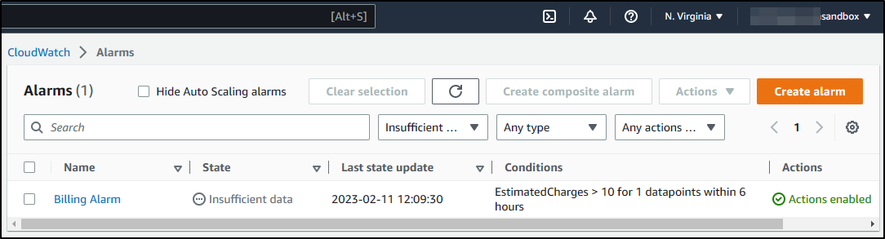
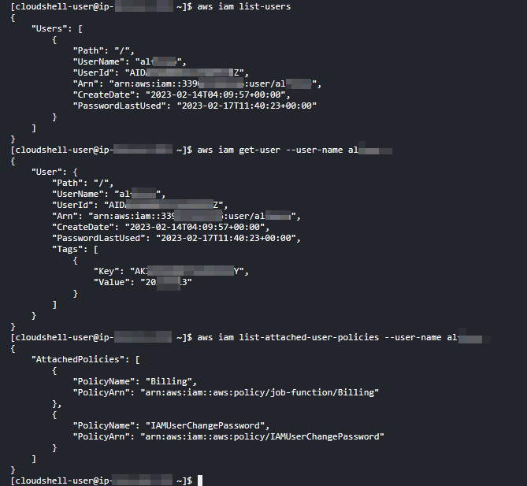
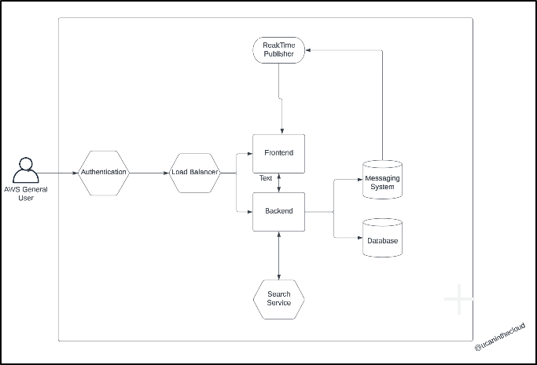
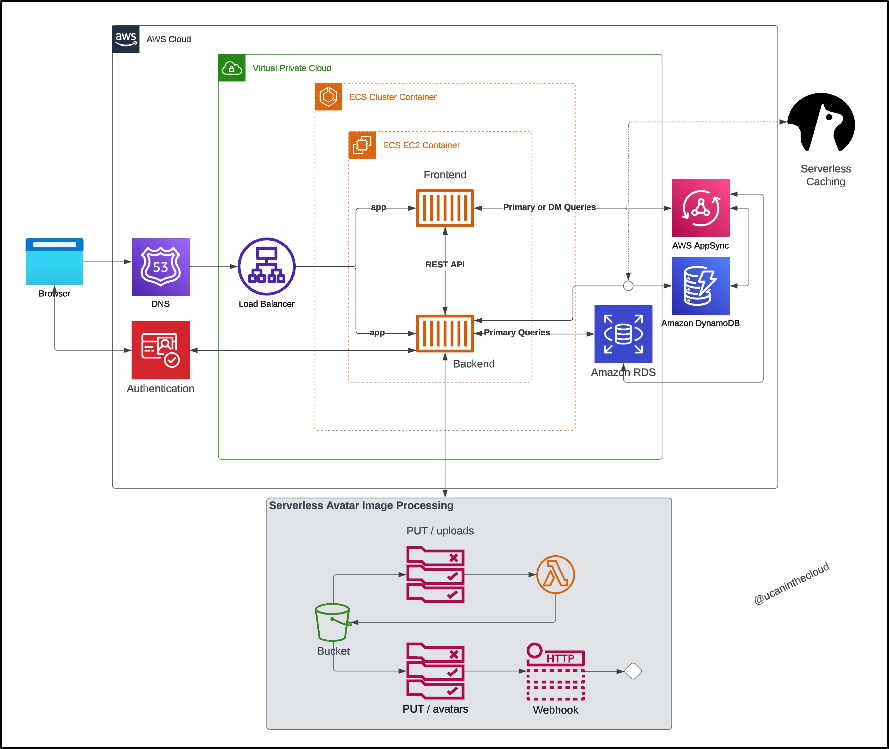
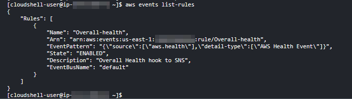

# Week 0 — Billing and Architecture
## Security ##
MFA was enabled for the root account
Enabled 1 CloudWatch Billing alarm if sepnd is over $10.00 USD.
Created 2 Budgets:
1. AWS BootCamp Credits with a Maximum of $3.00 and three thresholds of 50, 75 and 100% 
2. Zero-Spend Budget with a Maximum of $1.00



3. Created a new account with FullAdmin permissions and attached the Billing policy.



4. Enabled MFA and created access key for non-root account.

## Design ##

5. Completed [Conceptual Diagram](https://lucid.app/lucidchart/f1c2d8fa-3444-4e0e-9058-783a0db427ef/edit?viewport_loc=-612%2C-386%2C4039%2C1998%2C0_0&invitationId=inv_acf742dd-1df7-429f-82e6-0e8e2a3c57bc)in Lucid:



 
6. Completed Lucid [Logical Architectural](https://lucid.app/lucidchart/2d7bf0e1-b921-46c6-b905-c52e89db76be/edit?viewport_loc=-322%2C83%2C2994%2C1481%2C0_0&invitationId=inv_a38e7eae-3399-4c19-ac50-c61d7a022914) Diagram:



```One of the interesting things I needed to tweak a little bit was the Momento logo. Andrew showed how he was editing this via Visual Studio Code and removed a couple of tags. 

I ended up changing the fill from none to black on the first line as well as removing the fill="currentColor"> for both path tags. 

I added the momento_logo_original.svg and momento_logo.svg within the assets directory
```

## Additional Configuration ##

7. Logged in to the non-root account and created an EventBridge rule. 



8. Launched Gitpod and setup my workspace. Using https://gitpod.io/#mygithuburl

9. Added my credentials to the current session using the following environment variables:

```
export AWS_ACCESS_KEY_ID=""
export AWS_SECRET_ACCESS_KEY=""
export AWS_DEFAULT_REGION=us-east-1
```

10. I did not made them persistent as I wasn't sure (yet) about Gitpod security. I need to dig more about this.

11. I just realized Gitpod only provides 500 hrs of compute so I am stopping my updates to the journal from there and I am using Visual Studio Code locally on my own device. (I will create an article next week about the setup from the beginning)


## Homework challenges

12. It might not be a large one but I added the billing policy to the IAM user (already shared the account)

13. Created the Eventbridge rule to AWS health.

14. I have an old AWS account so I created an Organization from that one and invited my bootcamp account. I am researching more information about billing to the main organization account.

15. I am not going to use the Organization as I identified that **For AWS Organizations, the AWS Free Tier eligibility for all member accounts begins on the day that the management account is created.** from [AWS billing free Tier](https://docs.aws.amazon.com/awsaccountbilling/latest/aboutv2/billing-free-tier.html).