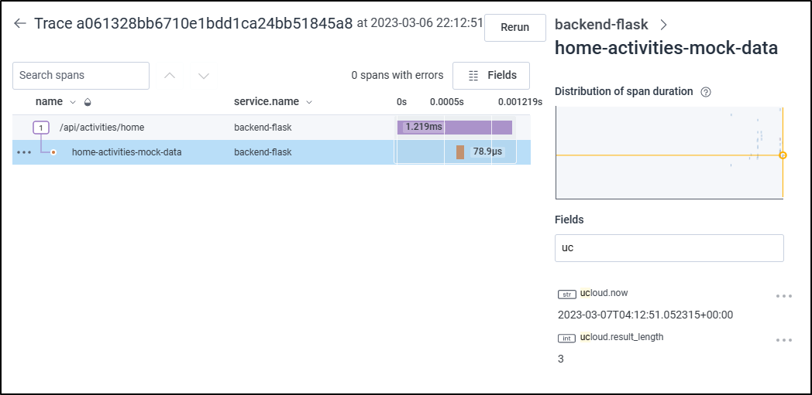
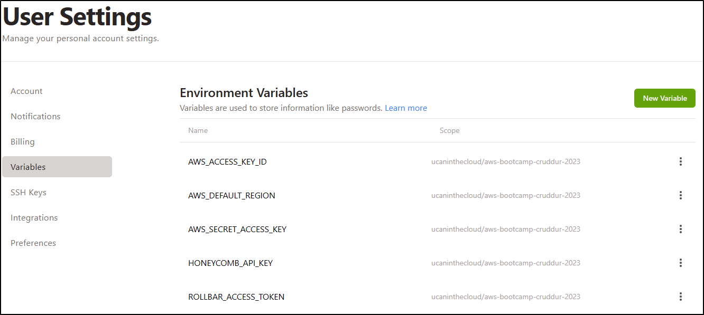
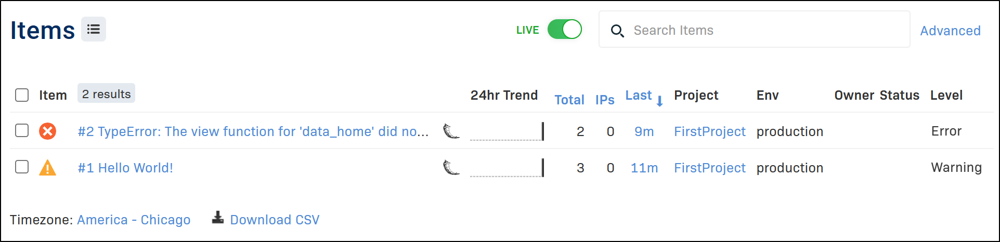
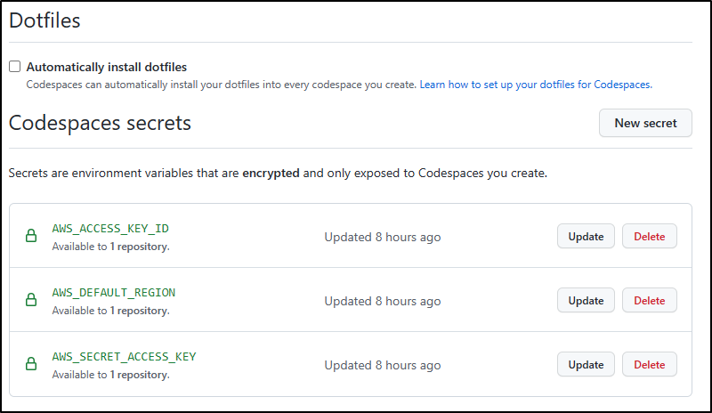
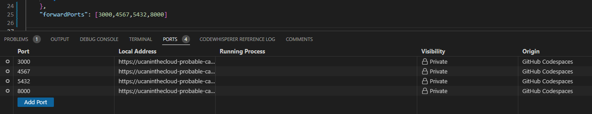
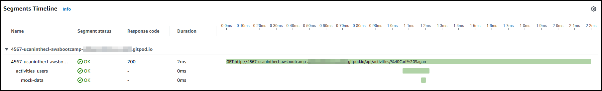
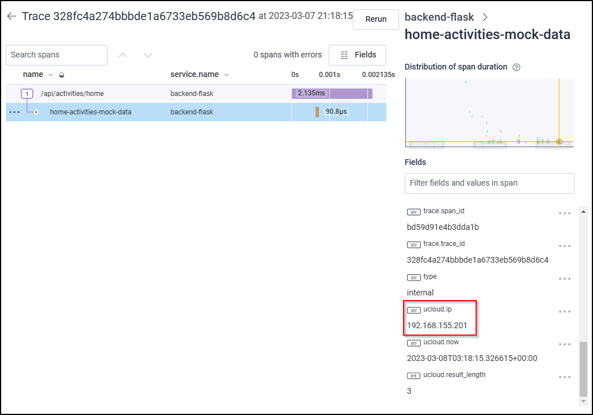

# Week 2 — Distributed Tracing

## Honeycomb

The first thing I did for week 2 was to update my ../reference/gitpod_vars file by adding the Honeycomb variables

```bash
export HONEYCOMB_API_KEY=""
export HONEYCOMB_SERVICE_NAME="Cruddur"
```

As suggested by Jessica (and demonstrated by Andrew) I also updated the docker-compose.yml to include the OTEL environment variables:

```yml
OTEL_SERVICE_NAME: 'backend-flask'
OTEL_EXPORTER_OTLP_ENDPOINT: "https://api.honeycomb.io"
OTEL_EXPORTER_OTLP_HEADERS: "x-honeycomb-team=${HONEYCOMB_API_KEY}"
```

Later I added the OpenTelemetry python packages to requirements.txt as well as added the Initialize code.

The compose up started the containers but it was not sending data to Honeycomb (even after hitting an endpoint more than 5 times). I realized the Honeycomb API key variable is not passed to the container so I needed to save it to Gitpod using:

```bash
gp env HONEYCOMB_API_KEY="MySuperSecretKey"
```

I then closed my whole workspace and re-launched it. After composing up one more time, it started to send data right away!

Added one new span and two fields on that new span. I called them ucloud:



Just for documentation and to remember later, https://honeycomb-whoami.glitch.me can be used to determine the environment for a specific key.

https://docs.honeycomb.io/getting-data-in/opentelemetry/python/


## AWS X-Ray

1. I added the below line to the requirements.txt, so that it can be loaded when starting the container

```bash
aws-xray-sdk
```

2. As I wanted to continue sending data to Honeycomb, I just added two lines to the environment section for the backend-flask service in the docker-compose.yml:

```yml
      AWS_XRAY_URL: "*4567-${GITPOD_WORKSPACE_ID}.${GITPOD_WORKSPACE_CLUSTER_HOST}*"
      AWS_XRAY_DAEMON_ADDRESS: "xray-daemon:2000"
```

3. A new service container was also added to the same docker-compose.yml to start the xray-daemon.

```yml
  xray-daemon:
    image: "amazon/aws-xray-daemon"
    environment:
      AWS_ACCESS_KEY_ID: "${AWS_ACCESS_KEY_ID}"
      AWS_SECRET_ACCESS_KEY: "${AWS_SECRET_ACCESS_KEY}"
      AWS_REGION: "us-east-1"
    command:
      - "xray -o -b xray-daemon:2000"
    ports:
      - 2000:2000/udp
```

4. At this point I realized I needed to use the AWS cli to create a new XRAY group and set my running session environment variables with the data I had in my [gitpod_vars](../_reference/gitpod_vars) file.

5. Once they were set, the Cruddur group was created:

```bash
aws xray create-group \
--group-name "Cruddur" \
--filter-expression "service(\"backend-flask\")"
```

6. As mentioned via the instructions, I created a sampling rule and saved it as [xray.json](../aws/json/xray.json)

```json
{
  "SamplingRule": {
      "RuleName": "Cruddur",
      "ResourceARN": "*",
      "Priority": 9000,
      "FixedRate": 0.1,
      "ReservoirSize": 5,
      "ServiceName": "backend-flask",
      "ServiceType": "*",
      "Host": "*",
      "HTTPMethod": "*",
      "URLPath": "*",
      "Version": 1
  }
}
```

7. After this, I "saved" or pushed this sampling rule to AWS via the following command:

```bash
aws xray create-sampling-rule --cli-input-json file://aws/json/xray.json
```

8. The last thing was to set X-Ray in the app.py. First I added the modules:

```python
# X-Ray 
from aws_xray_sdk.core import xray_recorder
from aws_xray_sdk.ext.flask.middleware import XRayMiddleware
```

9. And configured the recorder:

```python
# XRay recorder 
xray_url = os.getenv("AWS_XRAY_URL")
xray_recorder.configure(service='backend-flask', dynamic_naming=xray_url)
```

10. Attempted a compose up but it wasn't sending data to AWS. I realized I needed to save the AWS keys as variables to gitpod. I configured them as gitpod exports and stop the current workspace. When the new workspace was reloaded, and docker was brought up, I was able to get segments in the console:


Segment information:


<br>

## AWS Cloudwatch

1. The first thing is to add the watchtower to [requirements.txt](../backend-flask/requirements.txt) so the python library will be installed for that container.

2. pip install -r requirements.txt within the backend-flask folder will install watchtower and the rest of components. 

3. Updated the app.py file to import watchtower and logging as well as to initiate the logger

```py
import watchtower
import logging
from time import strftime
```

```py
# Configuring Logger to Use CloudWatch
LOGGER = logging.getLogger(__name__)
LOGGER.setLevel(logging.DEBUG)
console_handler = logging.StreamHandler()
cw_handler = watchtower.CloudWatchLogHandler(log_group='cruddur')
LOGGER.addHandler(console_handler)
LOGGER.addHandler(cw_handler)
LOGGER.info("Testing the log for /api/activities/home")
```

4. Later I updated the [home_activities.py](../backend-flask/app.py) with the function required "after_request"

```py
@app.after_request
def after_request(response):
    timestamp = strftime('[%Y-%b-%d %H:%M]')
    LOGGER.error('%s %s %s %s %s %s', timestamp, request.remote_addr, request.method, request.scheme, request.full_path, response.status)
    return response
```

5. The last piece before attempting for the first time was to set the AWS variables on the [docker-compose.yml](../docker-compose.yml)

```yml
    AWS_DEFAULT_REGION: "${AWS_DEFAULT_REGION}"
    AWS_ACCESS_KEY_ID: "${AWS_ACCESS_KEY_ID}"
    AWS_SECRET_ACCESS_KEY: "${AWS_SECRET_ACCESS_KEY}"
```

6. I encountered the same error because the LOGGER variable was not defined. The following lines were edited

>- [home_activities](../backend-flask/services/home_activities.py)
```py
class HomeActivities:
  def run(logger):
    logger.info("home activities")
```

>- [app.py](../backend-flask/app.py)

```py
@app.route("/api/activities/home", methods=['GET'])
def data_home():
  data = HomeActivities.run(logger=LOGGER)
```

7. After some time, the logs appeared within the CloudWatch > Log groups > cruddur


<br>

### Cost considerations

To reduce spend during the testing, we can comment all Cloudwatch logs as well as X-Ray. 

- [home_activities](../backend-flask/services/home_activities.py)
```py
class HomeActivities:
  def run():
    #logger.info("home activities")
    with tracer.start_as_current_span("home-activities-mock-data"):
```

- [app.py](../backend-flask/app.py)

```py
# XRay recorder 
# xray_url = os.getenv("AWS_XRAY_URL")
# xray_recorder.configure(service='backend-flask', dynamic_naming=xray_url)

# Configuring Logger to Use CloudWatch
# LOGGER = logging.getLogger(__name__)
# LOGGER.setLevel(logging.DEBUG)
# console_handler = logging.StreamHandler()
# cw_handler = watchtower.CloudWatchLogHandler(log_group='cruddur')
# LOGGER.addHandler(console_handler)
# LOGGER.addHandler(cw_handler)
# LOGGER.info("Testing the log for /api/activities/home")

...

# XRayMiddleware(app, xray_recorder)

...

#@app.after_request
#def after_request(response):
#    timestamp = strftime('[%Y-%b-%d %H:%M]')
#    LOGGER.error('%s %s %s %s %s %s', timestamp, request.remote_addr, request.method, request.scheme, request.full_path, response.status)
#    return response

...

@app.route("/api/activities/home", methods=['GET'])
def data_home():
  data = HomeActivities.run()
```

## Rollbar

1. The first thing is to set blinker and rollbar in the [requirements.txt](../backend-flask/requirements.txt) file so these components are installed during the docker compose.

```
blinker
rollbar
```

2. Using Gitpod, you want to set the variables for every new workspace. This can be achieved with either:

```
gp env ROLLBAR_ACCESS_TOKEN="hex-rollbar-access-token"
```

> Or by setting a new variable manually on Gitpod.io > User Settings > Variables



<br>

3. As well as setting it on [docker-compose.yml](../docker-compose.yml)

ROLLBAR_ACCESS_TOKEN: "${ROLLBAR_ACCESS_TOKEN}"

4. To instrument rollbar, it first need to be defined in the [app.py](../backend-flask/app.py)

```py
import os
import rollbar
import rollbar.contrib.flask
from flask import got_request_exception
```

> The following code goes after the app is defined:

```py
rollbar_access_token = os.getenv('ROLLBAR_ACCESS_TOKEN')
@app.before_first_request
def init_rollbar():
    """init rollbar module"""
    rollbar.init(
        # access token
        rollbar_access_token,
        # environment name
        'production',
        # server root directory, makes tracebacks prettier
        root=os.path.dirname(os.path.realpath(__file__)),
        # flask already sets up logging
        allow_logging_basic_config=False)

    # send exceptions from `app` to rollbar, using flask's signal system.
    got_request_exception.connect(rollbar.contrib.flask.report_exception, app)
```

> As well as defining a new endpoint:

```py
@app.route('/rollbar/test')
def rollbar_test():
    rollbar.report_message('Hello World!', 'warning')
    return "Hello World!"
```
5. The docker compose up brought all containers and below is a screenshot with what Rollbar reported:




<br>
<br>

## Github Codespaces

1. Created a .devcontainer directory in root and a devcontainer.json file. The contents are:

```json
{
	"name": "Configuration for Github spaces with Cruddur",
	"workspaceFolder": "/workspaces/${localWorkspaceFolderBasename}",
	// Features to add to the dev container. More info: https://containers.dev/features.
	// "features": {},
	"features": {
		"ghcr.io/devcontainers/features/aws-cli:1": {}
	},
	"remoteEnv": {
		"AWS_CLI_AUTO_PROMPT": "on-partial"
	},
	"customizations": {
		"vscode": {
			"extensions": [
				"ms-azuretools.vscode-docker",
				"ms-python.python"
			],
			"settings": {
				"workbench.colorTheme": "Default Dark+"
			}
		}
	}
}
```

2. I logged in to Github.com and went to **Settings** > **Code, planning, and automation** > **Codespaces** and added three "secrets"



3. Updated the [docker-compose.yml](../docker-compose.yml) file to include the correct GitHub Codespaces variables for the backend-flask

```yml
      FRONTEND_URL: "https://${CODESPACE_NAME}-3000.${GITHUB_CODESPACES_PORT_FORWARDING_DOMAIN}"
      BACKEND_URL: "https://${CODESPACE_NAME}-4567.${GITHUB_CODESPACES_PORT_FORWARDING_DOMAIN}"
      AWS_XRAY_URL: "*${CODESPACE_NAME}-4567.${GITHUB_CODESPACES_PORT_FORWARDING_DOMAIN}*"
```

> And for the frontend-flask-react

```yml
      REACT_APP_BACKEND_URL: "https://${CODESPACE_NAME}-4567.${GITHUB_CODESPACES_PORT_FORWARDING_DOMAIN}"
```

4. After that, I tried to rebuild the Codespace and it loaded with only one issue, the ports are not opened by default. This is something that is still not possible (https://github.com/community/community/discussions/10394) with Github Codespaces so I just set the ports to be forwarded:



<br>
<br>

## XRay Subsegmenting

After following the video, I was able to fix the closing of subsegmenting on the [user_activities.py](../backend-flask/services/user_activities.py).

XRay updated the segments correctly now:




<br>

## Challenge homework

I added another instrumentation to the app, it is the remote ip_address. It is not working as expected so I will investigate a little bit further on it.

In order for it to work, I added ```from flask import request``` at the beginning of the home_activities.py file and at the bottom the following:

```python
      ip_address = request.remote_addr
      span.set_attribute("ucloud.ip", str(ip_address))
```

This results in the following in Honeycomb:



