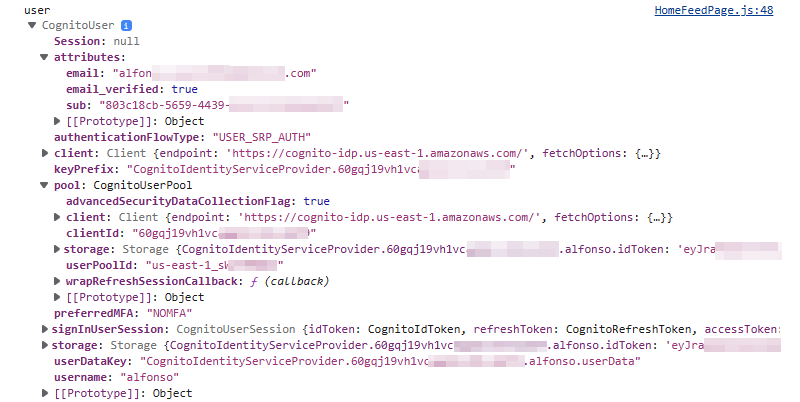

# Week 3 — Decentralized Authentication

## Creating a new user pool

1. You need to create a new user pool.


<br>

2. Now the configuration should include **User name** and **email**


<br>

3. Leave the **Cognito defaults** and scroll down for MFA configuration (for this test, do not use MFA). Leave also the account recovery options to **Self-service account recovery** and let the default to be **Email** to minimize AWS cost due to SMS.


<br>


<br>

4. Leave **Self-service sign-up** and **Allow Cognito to automatically send messages**. Verify attributes changes by sending an email and select any required attributes. On below's screenshots we are selecting only **name** but later we may require **email** as well.


<br>


<br>

5. We are going to use the Cognito service until SES is setup for the project. 


<br>

6. Assign a user pool name. I setup as **cruddur_user_pool_clickops** but somehow I captured the screenshot as new_user_pool_name:


<br>

7. Leave the **Public client** when developing service applications and assign a meaningful **App client name**.


<br>

8. Submit to create and it is done!


## AWS Amplify

In order to use Cognito, we need to use the AWS Amplify Javascript library. This needs to be installed on the frontend-react-js directory (Similar to the standard **npm install**).

1. I added the installation to the [.gitpod.yml](../.gitpod.yml)

```yml
  - name: npm front-end
    init: |
      cd ./frontend-react-js
      npm install
      npm i aws-amplify
```

2. Edited the [App.js](../frontend-react-js/src/App.js) by adding the import statement:

```js
import { Amplify } from 'aws-amplify';
```

3. Added the Amplify configuration block after the last import statement:

```js
Amplify.configure({
  "AWS_PROJECT_REGION": process.env.REACT_APP_AWS_PROJECT_REGION,
  "aws_cognito_identity_pool_id": process.env.REACT_APP_AWS_COGNITO_IDENTITY_POOL_ID,
  "aws_cognito_region": process.env.REACT_APP_AWS_COGNITO_REGION,
  "aws_user_pools_id": process.env.REACT_APP_AWS_USER_POOLS_ID,
  "aws_user_pools_web_client_id": process.env.REACT_APP_CLIENT_ID,
  "oauth": {},
  Auth: {
    region: process.env.REACT_APP_AWS_PROJECT_REGION, //fixed this line to include _APP before _AWS
    userPoolId: process.env.REACT_APP_AWS_USER_POOLS_ID,
    userPoolWebClientId: process.env.REACT_APP_CLIENT_ID,
  }
});
```

4. From the above code, the REACT Environment variables were declared in the [docker-compose.yml](../docker-compose.yml) and also within Gitpod:

```yml
REACT_APP_AWS_PROJECT_REGION: "${AWS_DEFAULT_REGION}"
REACT_APP_AWS_COGNITO_REGION: "${AWS_DEFAULT_REGION}"
REACT_APP_AWS_USER_POOLS_ID: "${AWS_USER_POOLS_ID}"
REACT_APP_CLIENT_ID: "${APP_CLIENT_ID}"
```


<br>

5. Udpated the [HomeFeedpage.js](../frontend-react-js/src/pages/HomeFeedPage.js) by adding the amplify import statement.

```js
import { Auth } from 'aws-amplify';
```

6. Replaced the previous checkAuth constant with:

```js
const checkAuth = async () => {
  Auth.currentAuthenticatedUser({
    // Optional, By default is false. 
    // If set to true, this call will send a 
    // request to Cognito to get the latest user data
    bypassCache: false 
  })
  .then((user) => {
    console.log('user',user);
    return Auth.currentAuthenticatedUser()
  }).then((cognito_user) => {
      setUser({
        display_name: cognito_user.attributes.name,
        handle: cognito_user.attributes.preferred_username
      })
  })
  .catch((err) => console.log(err));
};
```

7. Replace **import Cookies from 'js-cookie'** within the [ProfileInfo.js](../frontend-react-js/src/components/ProfileInfo.js) with the following import

```js
import { Auth } from 'aws-amplify';
```

8. Because the cookies were removed, the **Cookies** need to be replaced in the rest of the code:

> Old
```js
  const signOut = async () => {
    console.log('signOut')
    // [TODO] Authenication
    Cookies.remove('user.logged_in')
    //Cookies.remove('user.name')
    //Cookies.remove('user.username')
    //Cookies.remove('user.email')
    //Cookies.remove('user.password')
    //Cookies.remove('user.confirmation_code')
    window.location.href = "/"
  }
```

> New
```js
const signOut = async () => {
  try {
      await Auth.signOut({ global: true });
      window.location.href = "/"
  } catch (error) {
      console.log('error signing out: ', error);
  }
}
```

## Sign-in Page

1. Modify the [SigninPage.js](../frontend-react-js/src/pages/SigninPage.js) by replacing the cookes import with the AWS-amplify import statement and a couple constants:

> Old
```js
import Cookies from 'js-cookie';
```

```js
  const onsubmit = async (event) => {
    event.preventDefault();
    setErrors('')
    console.log('onsubmit')
    if (Cookies.get('user.email') === email && Cookies.get('user.password') === password){
      Cookies.set('user.logged_in', true)
      window.location.href = "/"
    } else {
      setErrors("Email and password is incorrect or account doesn't exist")
    }
    return false
  }
```

> New
```js
import { Auth } from 'aws-amplify';
```

```js
const onsubmit = async (event) => {
  setErrors('')
  event.preventDefault();
  try {
    Auth.signIn(email, password)
      .then(user => {
        localStorage.setItem("access_token", user.signInUserSession.accessToken.jwtToken)
        window.location.href = "/"
      })
      .catch(err => { console.log('Error!', err) });
  } catch (error) {
    if (error.code == 'UserNotConfirmedException') {
      window.location.href = "/confirm"
    }
    setErrors(error.message)
  }
  return false
}
```

2. Modify the [Profile.js](../frontend-react-js/src/components/ProfileInfo.js) to also use aws-amplify and the method:

> Old
```js
import Cookies from 'js-cookie';
```

```js
  const signOut = async () => {
    console.log('signOut')
    // [TODO] Authenication
    Cookies.remove('user.logged_in')
    //Cookies.remove('user.name')
    //Cookies.remove('user.username')
    //Cookies.remove('user.email')
    //Cookies.remove('user.password')
    //Cookies.remove('user.confirmation_code')
    window.location.href = "/"
  }
```

> New
```js
import { Auth } from 'aws-amplify';
```

```js
  const signOut = async () => {
    try {
        await Auth.signOut({ global: true });
        window.location.href = "/"
    } catch (error) {
        console.log('error signing out: ', error);
    }
  }
```

3. Commited the code to Github and triggered Gitpod.io workspace. (I prefer to keep updating the code in my local VSCode and then testing in Gitpod to reduce my usage)

4. After a couple attempts, this worked. I spent several days with an issue because I missed to update the application Client Id variable because I deleted and created a new user pool. 



<br>


## Custom Signup

1. Update the [SignupPage.js](../frontend-react-js/src/pages/SignupPage.js) to remove cookies and the onsubmit function

> Old
```js
import Cookies from 'js-cookie';
```

```js
  const onsubmit = async (event) => {
    event.preventDefault();
    console.log('SignupPage.onsubmit')
    // [TODO] Authenication
    Cookies.set('user.name', name)
    Cookies.set('user.username', username)
    Cookies.set('user.email', email)
    Cookies.set('user.password', password)
    Cookies.set('user.confirmation_code',1234)
    window.location.href = `/confirm?email=${email}`
    return false
  }
```

> New
```js
import { Auth } from 'aws-amplify';
```

```js
const onsubmit = async (event) => {
  event.preventDefault();
  setErrors('')
  try {
    const { user } = await Auth.signUp({
      username: email,
      password: password,
      attributes: {
        name: name,
        email: email,
        preferred_username: username,
      },
      autoSignIn: { // optional - enables auto sign in after user is confirmed
        enabled: true,
      }
      });
      console.log(user);
      window.location.href = `/confirm?email=${email}`
  } catch (error) {
    console.log(error);
    setErrors(error.message)
  }
  return false
}
```

2. 


> Old
```js
import Cookies from 'js-cookie'
```

```js
  const resend_code = async (event) => {
    console.log('resend_code')
    // [TODO] Authenication
  }

  const onsubmit = async (event) => {
    event.preventDefault();
    console.log('ConfirmationPage.onsubmit')
    // [TODO] Authenication
    if (Cookies.get('user.email') === undefined || Cookies.get('user.email') === '' || Cookies.get('user.email') === null){
      setErrors("You need to provide an email in order to send Resend Activiation Code")   
    } else {
      if (Cookies.get('user.email') === email){
        if (Cookies.get('user.confirmation_code') === code){
          Cookies.set('user.logged_in',true)
          window.location.href = "/"
        } else {
          setErrors("Code is not valid")
        }
      } else {
        setErrors("Email is invalid or cannot be found.")   
      }
    }
    return false
  }
```

> New
```js
import { Auth } from 'aws-amplify'; 
```

```js
const resend_code = async (event) => {
  setErrors('')
  try {
    await Auth.resendSignUp(email);
    console.log('code resent successfully');
    setCodeSent(true)
  } catch (err) {
    // does not return a code
    // does cognito always return english
    // for this to be an okay match?
    console.log(err)
    if (err.message == 'Username cannot be empty'){
      setErrors("You need to provide an email in order to send Resend Activiation Code")   
    } else if (err.message == "Username/client id combination not found."){
      setErrors("Email is invalid or cannot be found.")   
    }
  }
}

const onsubmit = async (event) => {
  event.preventDefault();
  setErrors('')
  try {
    await Auth.confirmSignUp(email, code);
    window.location.href = "/"
  } catch (error) {
    setErrors(error.message)
  }
  return false
}
```

## Recover Page

1. The following is an update to the [RecoverPage.js](../frontend-react-js/src/pages/RecoverPage.js) sp we can get a temp password


> Old
```js
  const onsubmit_send_code = async (event) => {
    event.preventDefault();
    console.log('onsubmit_send_code')
    return false
  }
  const onsubmit_confirm_code = async (event) => {
    event.preventDefault();
    console.log('onsubmit_confirm_code')
    return false
  }
```

> New
```js
import { Auth } from 'aws-amplify';
```

```js
  const onsubmit_send_code = async (event) => {
    event.preventDefault();
    setErrors('')
    Auth.forgotPassword(username)
    .then((data) => setFormState('confirm_code') )
    .catch((err) => setErrors(err.message) );
    return false
  }
  const onsubmit_confirm_code = async (event) => {
    event.preventDefault();
    setErrors('')
    if (password == passwordAgain){
      Auth.forgotPasswordSubmit(username, code, password)
      .then((data) => setFormState('success'))
      .catch((err) => setErrors(err.message) );
    } else {
      setErrors('Passwords do not match')
    }
    return false
  }
```

## Server side security

1. Create the headers within the [HomeFeedPage.js](../frontend-react-js/src/pages/HomeFeedPage.js) for the api/activities/home endpoint

```js
headers: {
          Authorization: `Bearer ${localStorage.getItem("access_token")}`
        },
```

2. Also include a print to the Authorization header in the [app.py](../backend-flask/app.py) for the backend:

> Old
```py
@app.route("/api/activities/home", methods=['GET'])
@xray_recorder.capture('activities_home')
def data_home():
  data = HomeActivities.run(logger=LOGGER)
  return data, 200
```

```py
cors = CORS(
  app, 
  resources={r"/api/*": {"origins": origins}},
  expose_headers="location,link",
  allow_headers="content-type,if-modified-since",
  methods="OPTIONS,GET,HEAD,POST"
)
```


> New
```py
@app.route("/api/activities/home", methods=['GET'])
@xray_recorder.capture('activities_home')
def data_home():
  app.logger.debug("AUTH HEADER----")
  app.logger.debug(
     request.headers.get('Authorization')
  )
  data = HomeActivities.run(logger=LOGGER)
  return data, 200
```

```py
cors = CORS(
  app, 
  resources={r"/api/*": {"origins": origins}},
  headers=['Content-Type', 'Authorization'], 
  expose_headers='Authorization',
  methods="OPTIONS,GET,HEAD,POST"
)
```


> Old
```js

```

```js

```

> New
```js

```

```js

```